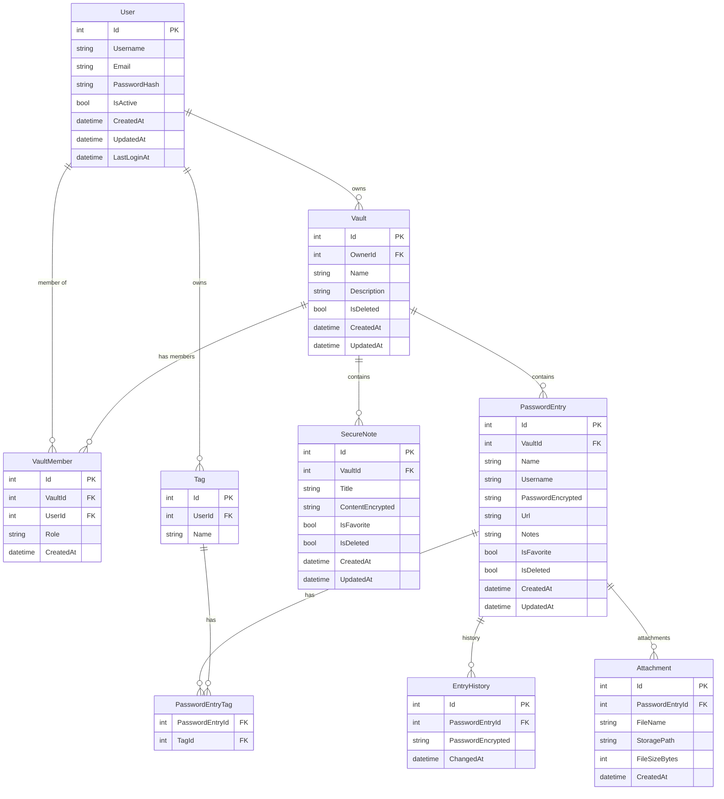

# The Shed — Diagrama de Base de Datos

## Notas

- `VaultMember.Role` → `ReadOnly` | `ReadWrite`
- `PasswordEncrypted` y `ContentEncrypted` → cifrado AES-256, nunca en texto plano
- Todas las entidades principales heredan `AuditableEntity` (soft delete + timestamps)
- `Tag` es por usuario, no global — cada uno tiene sus propias etiquetas
- `Attachment.StoragePath` → ruta al archivo en disco/blob storage (no se guarda el binario en la DB)
