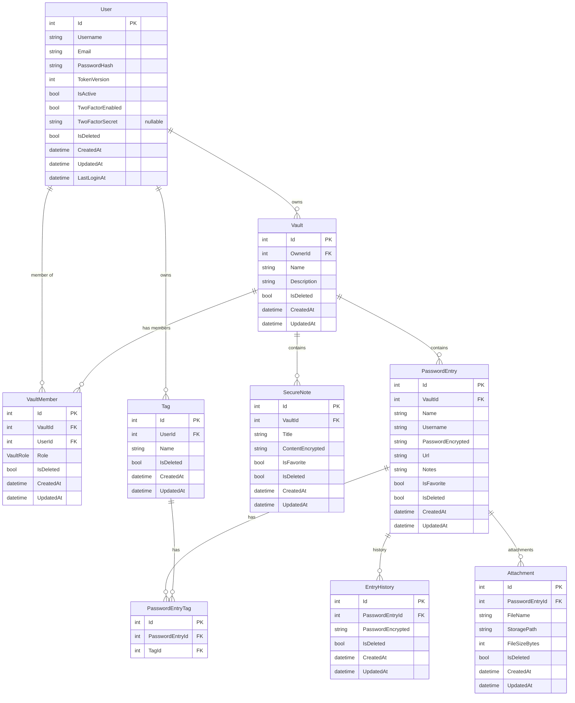

# The Shed — Database diagram

```mermaid
erDiagram

    User {
        int Id PK
        string Username
        string Email
        string PasswordHash
        int TokenVersion
        bool IsActive
        bool TwoFactorEnabled
        string TwoFactorSecret "nullable"
        bool IsDeleted
        datetime CreatedAt
        datetime UpdatedAt
        datetime LastLoginAt
    }

    Vault {
        int Id PK
        int OwnerId FK
        string Name
        string Description
        bool IsDeleted
        datetime CreatedAt
        datetime UpdatedAt
    }

    VaultMember {
        int Id PK
        int VaultId FK
        int UserId FK
        VaultRole Role
        bool IsDeleted
        datetime CreatedAt
        datetime UpdatedAt
    }

    PasswordEntry {
        int Id PK
        int VaultId FK
        string Name
        string Username
        string PasswordEncrypted
        string Url
        string Notes
        bool IsFavorite
        bool IsDeleted
        datetime CreatedAt
        datetime UpdatedAt
    }

    SecureNote {
        int Id PK
        int VaultId FK
        string Title
        string ContentEncrypted
        bool IsFavorite
        bool IsDeleted
        datetime CreatedAt
        datetime UpdatedAt
    }

    Tag {
        int Id PK
        int UserId FK
        string Name
        bool IsDeleted
        datetime CreatedAt
        datetime UpdatedAt
    }

    PasswordEntryTag {
        int Id PK
        int PasswordEntryId FK
        int TagId FK
    }

    EntryHistory {
        int Id PK
        int PasswordEntryId FK
        string PasswordEncrypted
        bool IsDeleted
        datetime CreatedAt
        datetime UpdatedAt
    }

    Attachment {
        int Id PK
        int PasswordEntryId FK
        string FileName
        string StoragePath
        int FileSizeBytes
        bool IsDeleted
        datetime CreatedAt
        datetime UpdatedAt
    }

    User ||--o{ Vault : "owns"
    User ||--o{ VaultMember : "member of"
    User ||--o{ Tag : "owns"
    Vault ||--o{ VaultMember : "has members"
    Vault ||--o{ PasswordEntry : "contains"
    Vault ||--o{ SecureNote : "contains"
    PasswordEntry ||--o{ PasswordEntryTag : "has"
    Tag ||--o{ PasswordEntryTag : "has"
    PasswordEntry ||--o{ EntryHistory : "history"
    PasswordEntry ||--o{ Attachment : "attachments"
```

## Notes

- `VaultRole` → `Viewer` (read-only) | `Editor` (read+write)
- `PasswordEncrypted` and `ContentEncrypted` → AES-256 encrypted, never plaintext
- `TwoFactorSecret` → TOTP secret, nullable (null = 2FA disabled)
- `TokenVersion` → copied into every JWT as the `tv` claim; bumping it revokes all of the user's sessions (D12)
- Every entity inherits `AuditableEntity` (soft delete + timestamps)
- `Tag` is per user, not global — each user has their own tags
- `Attachment.StoragePath` → path to the file on disk/blob storage (the binary is not stored in the DB)
